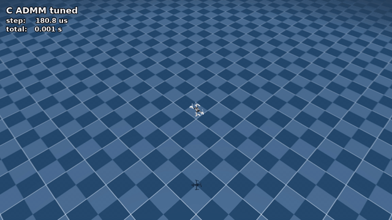
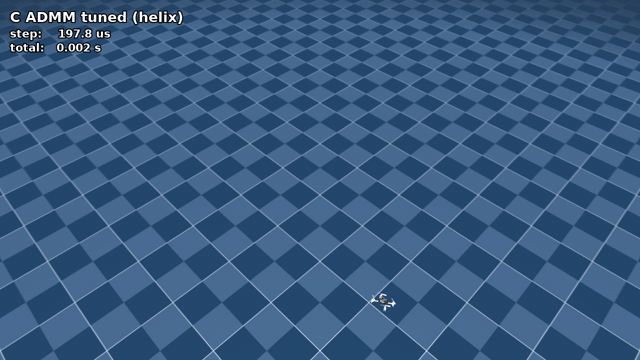
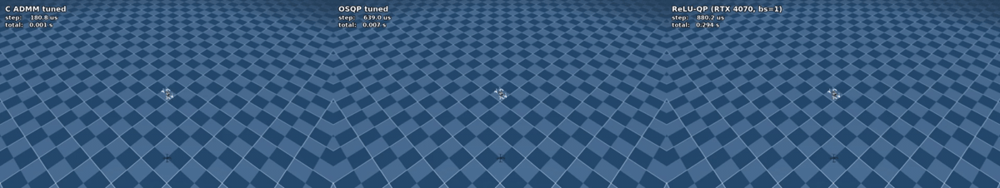
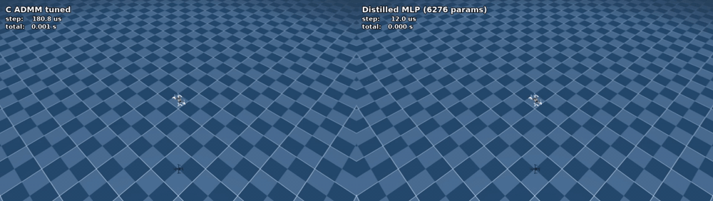

# Quadrotor MPC: Structure-Exploiting C ADMM, Solver Benchmarks, Neural Distillation

**A 458-line C ADMM solver for embedded quadrotor MPC at 9.4 µs / step — 22× faster than tuned OSQP, 196× faster than ReLU-QP at batch=1 — distilled into a 5,764-parameter MLP that runs in 2.1 µs.**

<!-- Headline video. Drag videos/c_admm_fig8.mp4 onto the GitHub README editor
     to get a CDN asset URL and replace this  with a <video autoplay loop muted>. -->


| solver                                  | median solve | RMSE       | hardware                       |
|-----------------------------------------|--------------|------------|--------------------------------|
| **C ADMM, tuned (ρ=3)**                 | **9.4 µs**   | **3.42 mm**| Intel i9-14900HX, single core  |
| OSQP, tuned                             | 203.4 µs     | 4.86 mm    | Intel i9-14900HX, single core  |
| ReLU-QP, batch=1, fp64                  | 1,841.7 µs   | 4.85 mm    | NVIDIA L40S                    |
| **Distilled MLP (5,764 params)**        | **2.1 µs**   | **4.1 mm** | Intel i9-14900HX, single core  |

> 22× faster than tuned OSQP at matched accuracy; the distilled policy then collapses the entire MPC stack into one matmul chain at another 4.5× over C ADMM.

Vrishabh Kenkre — CMU MS Mechanical Engineering, Robotics & Controls, 2026 — vkenkre@andrew.cmu.edu — [paper PDF](quadrotor_mpc_admm_delivery/quadrotor_mpc_admm_ieee.pdf)

## What this is

Real-time model-predictive control of small quadrotors is bottlenecked by the QP solver inside the control loop, not by the dynamics or the cost function. Off-the-shelf sparse solvers like OSQP burn ~14 µs per ADMM iteration on a sparse Cholesky update; for a $20$-step Crazyflie linear MPC that floor is ~200 µs/solve. This repo replaces that with a hand-rolled 458-line C ADMM solver that caches the infinite-horizon Riccati recursion and reduces the per-iteration work to $12{\times}12$ block operations. At 9.4 µs/solve on a single laptop CPU core it is fast enough to leave most of a 10 ms control budget free for everything else on the embedded stack; distilling it into a 5,764-parameter MLP collapses the entire pipeline into one matmul chain at 2.1 µs with the dynamics model and solver gone from the deployment binary.

## More demos

|  |  |
|---|---|
|  |  |
| `videos/c_admm_fig8.mp4` — headline (C ADMM tracking figure-8 at 1.11 m/s peak) | `videos/c_admm_helix.mp4` — C ADMM tracking a climbing helix (Table II helix row) |
|  |  |
| `videos/three_way_comparison.mp4` — C ADMM / OSQP / ReLU-QP on the same figure-8, with running solver wall-clock burned into each panel | `videos/dagger_vs_mpc.mp4` — distilled MLP (right) vs C ADMM teacher (left), same figure-8; the MLP runs in ~10 µs/step end-to-end through Python, ~2 µs as pure C |

## Quickstart (reproduce the headline numbers)

```bash
git clone <this-repo> && cd quad_mpc_project
conda create -n quad_mpc python=3.11 -y && conda activate quad_mpc
pip install -r requirements.txt && pip install torch==2.5.1  # add --index-url https://download.pytorch.org/whl/cu121 for GPU
bash setup.sh                                                # clones bitcraze_crazyflie_2 + patches actuators
gcc -O3 -ffast-math -march=native -shared -fPIC src/admm_core.c -o src/libadmm.so -lm
python3 src/bench_tuned_solvers.py
```

Expected output: a table whose tuned-C-ADMM row matches `results/bench_tuned_solvers_legion.json` within ±30 % on a single-core CPU. Absolute timings vary by CPU; the relative speedup over OSQP (≈22× on i9, ≈21× on Xeon-class) is preserved.

## Dependencies

Tested on Ubuntu 24.04 with the `quad_mpc` conda env (Python 3.11.15):

```
numpy        2.4.3          scipy        1.17.1
mujoco       3.6.0          osqp         1.1.1
casadi       3.7.2          matplotlib   3.10.8
torch        2.5.1          gymnasium    1.3.0
imageio      2.37.3         imageio-ffmpeg 0.6.0  (for video recording)
```

The C ADMM benchmark needs only numpy/scipy/mujoco/osqp/matplotlib; torch is required for the distillation pipeline, gymnasium for the env, imageio for `src/record_video.py`. Plus `gcc` (tested with `gcc-13`) for the C build, and `ffmpeg` if you want to stitch videos. Reproducing the ReLU-QP row additionally requires the upstream package and a CUDA GPU.

## What's in this repo

```
src/admm_core.{c,h}            458-line C ADMM solver with cached Riccati recursion
src/solver_admm_c.py           Python ctypes wrapper, Riccati precomputation
src/solver_admm.py             Pure-Python ADMM (reference)
src/solver_reluqp.py           ReLU-QP wrapper (condensed formulation; GPU)
src/mpc_osqp.py                OSQP baseline
src/bench_tuned_solvers.py     Canonical CPU benchmark harness (Table I in the paper)
src/tune_admm.py               ADMM hyperparameter sweep (ρ × max_iter × eps)
src/tune_osqp.py               OSQP hyperparameter sweep
src/quad_dynamics.py           Crazyflie linearization
src/quad_env.py                MuJoCo Crazyflie env wrapper
src/dagger.py                  DAgger distillation pipeline
src/dart_pipeline.py           DAgger + DART variants (six-way IL comparison)
src/policy_inference.{c,h}     Distilled-policy C inference (~2 µs per call)
src/policy_inference_py.py     ctypes wrapper around libpolicy_inference.so
src/policy_weights.h           Exported policy weights (5,764 params; see Known issues)
src/record_video.py            MuJoCo closed-loop recorder w/ per-step solve-time overlay + CSV
figures/three_way_pareto.py    Pareto plot generator (reads JSONs from results/)
render_crazyflie.py            MuJoCo render of the platform figure
videos/*.mp4                   Closed-loop demos (this README's gallery)
videos/*_solvetimes.csv        Per-step solve-time logs that produced the overlays
results/*.json                 Measured numbers (canonical for the paper)
results/*.png                  Figures from the paper
quadrotor_mpc_admm_delivery/   The IEEE paper (.tex + compiled .pdf)
```

## Reproducing each table and figure

| Paper artifact                          | Script                                       | Output                                  |
|-----------------------------------------|----------------------------------------------|-----------------------------------------|
| Table I (C ADMM latency configs)        | `src/bench_tuned_solvers.py`                 | `results/bench_tuned_solvers_legion.json` |
| Fig. 1 (Crazyflie render)               | `python3 render_crazyflie.py`                | `figures/crazyflie_platform.png`        |
| Fig. 4 (Pareto frontier)                | `figures/three_way_pareto.py`                | reads JSONs in `results/`               |
| Fig. 5 (closed-loop tracking)           | `src/bench_tuned_solvers.py`                 | `results/benchmark_tuned_final.png`     |
| Fig. 6 (distillation)                   | `src/dagger.py`                              | `results/dagger_results.png`            |
| ADMM tuning sweep                       | `src/tune_admm.py`                           | regenerates the configs in Table I      |
| OSQP tuning sweep                       | `src/tune_osqp.py`                           | `results/osqp_tuned_sweep_pareto.json`  |
| Table II (three-way summary)            | see Known issues                             | `results/bench_all_solvers.json`        |
| ReLU-QP GPU row                         | `src/solver_reluqp.py` (CUDA required)       | `results/reluqp_benchmark.json`         |
| All four demo videos                    | `src/record_video.py --solver X --traj Y`    | `videos/*.mp4` + per-step CSV           |


## Citing

```bibtex
@misc{kenkre2026admmquad,
  title  = {A Structure-Exploiting C ADMM Solver for Embedded Quadrotor MPC,
            with Solver Benchmarks and Neural Distillation},
  author = {Kenkre, Vrishabh},
  year   = {2026},
  note   = {preprint, in preparation},
}
```

Paper source: [`quadrotor_mpc_admm_delivery/quadrotor_mpc_admm_ieee.tex`](quadrotor_mpc_admm_delivery/quadrotor_mpc_admm_ieee.tex).

## License

MIT. See [`LICENSE`](LICENSE) for the solver core; the Bitcraze Crazyflie 2 MuJoCo model (cloned via `setup.sh`) is Apache 2.0 from `mujoco_menagerie`.
